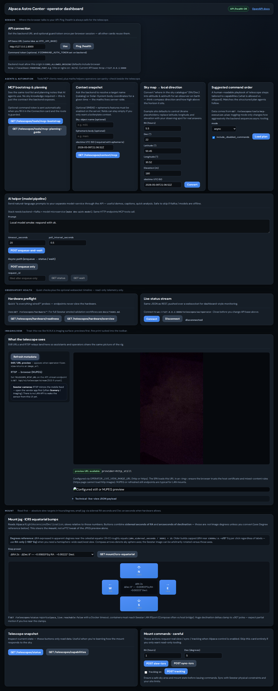
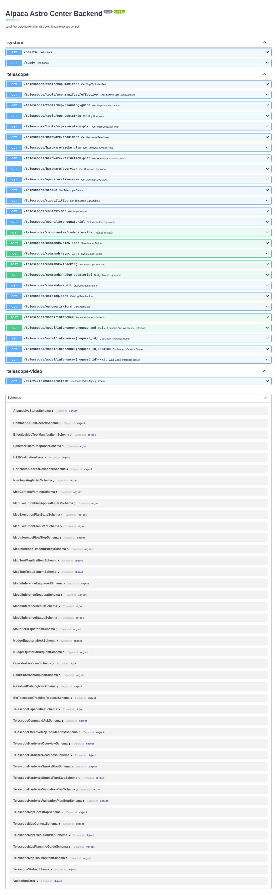

# Alpaca Astro Center

Local-first **FastAPI** backend for ASCOM Alpaca telescope control, optional **Kafka** + **model microservice**, and a minimal **React** operator UI. See **`docs/PROJECT_CONTEXT.md`**, **`docs/PLAN.md`**, and **`docs/TASKS.md`** for architecture and roadmap.

## Requirements

- [Docker](https://www.docker.com/get-started) & Docker Compose v2
- [GNU Make](https://www.gnu.org/software/make/)
- Optional: Node.js 20+ if you run the UI with `npm run dev` instead of Docker (see `frontend/README.md`)

## Quick start (Docker)

```bash
git clone https://github.com/YuriiDorosh/mcp-ascom-alpaca-bridge.git
cd mcp-ascom-alpaca-bridge
cp backend/.env.example backend/.env    # edit Mongo/Kafka/Alpaca as needed
cp frontend/.env.example frontend/.env # UI port + VITE_API_BASE (defaults OK for local API :8000)
make help
make dev                                 # API + Kafka, then UI (nginx)
```

Compose reads **`frontend/.env`** for `FRONTEND_PORT` and build-arg **`VITE_API_BASE`** (where the **browser** reaches the API). If you skip copying, defaults from `frontend/docker-compose.yaml` still work for a typical local setup.

- **API / Swagger:** http://localhost:8000/api/docs  
- **Operator UI:** http://localhost:5173 (override with `FRONTEND_PORT` in `frontend/.env`)

Stop stacks:

```bash
make dev-down
```

With the local model worker:

```bash
make dev-with-model
make dev-with-model-down
```

## What this looks like

Here is how the project looks in the browser with the operator UI and the backend OpenAPI docs.





<a id="linux-arp-lan-telescope"></a>

## Troubleshooting: Linux LAN drops (ARP / MAC conflicts)

Telescope **looks online** in the **router admin** and the **vendor mobile app**, but **this Linux PC** cannot connect: **Alpaca** (port **32323**), **RTSP / `ffplay`**, `curl`, `nc`, or **`ping`** may all fail together. The usual cause on Linux is a **stale or wrong ARP (neighbor) entry**: your kernel still maps the telescope’s IPv4 to an **old MAC address**, so packets go to the wrong host.

#### Symptoms

- Connections **time out** from the Linux machine.
- **`ping`** fails or shows **100% packet loss** toward the telescope IP.
- **RTSP** or **`ffplay rtsp://…`** cannot connect from that same PC.
- The **router still lists** the device and the **mobile app** still works—so the issue is often **L2 on the Linux host**, not “the scope is off the network”.

#### Cause

After DHCP churn, IP reuse, suspend/resume, or another device briefly using the same address, Linux can keep a **neighbor cache line** that points the telescope IP at the **wrong `lladdr`**. Traffic never reaches the real telescope.

#### Diagnosis

1. Note the **correct MAC** of the telescope from the **router DHCP client list** or the vendor app / device label.
2. Compare with the kernel table:

```bash
ip neigh show <TELESCOPE_IP>
```

If **lladdr** does not match the real telescope MAC, fix the cache before re-testing API, streams, or previews.

Find the **network interface** your PC uses on the home LAN (Wi‑Fi e.g. `wlp7s0`, `wlan0`; Ethernet e.g. `enp3s0`)—for example from the route to your gateway (replace with your router IP):

```bash
ip route get 10.47.210.1
```

#### Fixes

1. **Quick — flush neighbors on that interface**

   ```bash
   sudo ip neigh flush dev <your_network_interface>
   ```

2. **Local — pin the correct IP ↔ MAC (helps until reboot or table churn)**

   ```bash
   sudo ip neigh replace <TELESCOPE_IP> lladdr <TELESCOPE_MAC> dev <your_network_interface> nud permanent
   ```

   Use the colon-separated MAC from the router (e.g. `aa:bb:cc:dd:ee:ff`). This is **host-only**; prefer a router reservation for a stable long-term setup.

3. **Recommended — static DHCP reservation**

   In the router UI, bind the telescope’s **MAC** to a fixed **LAN IP**. Then set `ALPACA_ADDRESS` in `backend/.env` (and any bookmarks) to that IP.

#### Re-check

```bash
ping -c 3 <TELESCOPE_IP>
nc -zv -w2 <TELESCOPE_IP> 32323
curl -m 3 -s "http://<TELESCOPE_IP>:32323/management/v1/configureddevices"
```

Retry **RTSP / `ffplay`** once `ip neigh show` reports the **correct** lladdr.

## Repository layout

| Path | Role |
|------|------|
| `backend/` | Main app, Compose for API + Kafka, `Makefile`, tests |
| `frontend/` | Vite + React UI, its own `docker-compose.yaml` |
| `model-service/` | Inference microservice (Kafka loop) |
| `docs/` | Product docs, task checklist, Kafka policy |

## Tests

From `backend/` (no running Compose required for local pytest):

```bash
make ci-local          # backend + model-service pytest in Docker
make test-backend-local
```

## Hardware (Seestar / Alpaca)

Connecting a **Seestar S30 Pro** or running live slew commands is **optional** for development.

If the scope is **reachable from the phone/router** but **this Linux machine** times out (Alpaca, RTSP, `ping`), read **[Troubleshooting: Linux LAN drops (ARP / MAC conflicts)](#linux-arp-lan-telescope)** first.

When you are ready for hardware-in-the-loop checks, follow **`docs/TASKS.md` (Phase 5 Hardware Gate)** and **`backend/README.md`** (LAN, port **32323**, operator sequence, preflight Make targets, Postman, Kafka notes).
