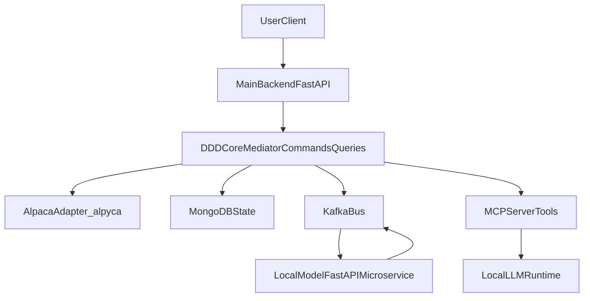

# Alpaca Astro Center - Development Plan

## Planning Principles

- Preserve the existing DDD + Mediator + manual DI architecture skeleton.
- Replace chat-oriented bounded context with telescope-oriented bounded contexts.
- Keep deployment local-first and Docker-first.
- Treat telescope control and AI inference as separate services connected by Kafka.

## Phase 1 - Template Adaptation and Cleanup

### Goal
Transform the current chat-template backend into a neutral telescope platform skeleton.

### Deliverables
- Project naming and metadata updated for Alpaca Astro Center.
- Chat/message API routes and handlers removed or isolated.
- Chat domain entities/events/use-cases removed or replaced.
- Telescope bounded context skeleton created (entities, commands, queries, interfaces).
- DI container updated for new ports/adapters.

### Readiness Criteria
- Backend starts without chat-domain modules.
- Health/readiness endpoints pass.
- No dead imports/references to legacy message/chat modules in startup path.

### Risks and Dependencies
- Existing cross-module imports from legacy message components may break startup.
- Needs careful dependency rewiring in composition root.

## Phase 2 - Alpyca and Astropy Integration

### Goal
Introduce real telescope control primitives and coordinate conversion workflows.

### Deliverables
- `alpyca` client adapter integrated behind interface (`IAlpacaClient`).
- Coordinate transformation service using `astropy`.
- Target resolution workflow definitions for future `astroquery` integration.
- Telescope control command/query flows (status, slew, sync, tracking-state).
- Basic unit tests for coordinate transforms and adapter behavior.

### Readiness Criteria
- Telescope status retrieval works through domain-driven command/query pipeline.
- Coordinate conversion use-cases produce deterministic outputs for test fixtures.
- Alpaca client calls are encapsulated behind interface-based adapters.

### Risks and Dependencies
- Real hardware variability in Alpaca implementations.
- Time/location accuracy required for robust coordinate conversion.
- Need fallback/simulator strategy when telescope hardware is unavailable.

## Phase 3 - MongoDB and Kafka for Telescope Events

### Goal
Establish durable telescope state persistence and event-driven messaging.

### Deliverables
- Mongo repositories for telescope sessions, targets, and operation history.
- Kafka topics and message contracts for telescope events/state transitions.
- Reliable producer/consumer lifecycle wiring in app startup.
- Event versioning strategy for forward compatibility.

### Readiness Criteria
- Main backend stores and retrieves telescope domain state from MongoDB.
- Telescope domain events are published/consumed via Kafka with traceable correlation IDs.
- Restart-safe processing strategy is documented.

### Risks and Dependencies
- Topic design and schema evolution decisions can affect all future services.
- Requires alignment on idempotency and retry semantics.

## Phase 4 - MCP Server and Local Model Microservice

### Goal
Expose telescope control as MCP tools and integrate local AI inference through Kafka.

### Deliverables
- Main backend MCP server layer with telescope-safe tool definitions.
- Dedicated local FastAPI model microservice implemented.
- Kafka contracts between main backend and model microservice finalized:
  - inference request events
  - inference result/status events
  - correlation and timeout behavior
- Guardrails for tool execution (validation, capability checks, safe failure modes).

### Readiness Criteria
- MCP tool requests can trigger full backend execution flows.
- Model microservice can process requests and return results through Kafka.
- End-to-end local flow works without cloud dependencies.

### Risks and Dependencies
- Contract drift between backend and model service.
- Latency and timeout management across async boundaries.
- Hardware profile differences (NVIDIA/AMD/CPU) affect model selection and response times.

## Phase 5 - WebSockets and Frontend Integration

### Goal
Provide real-time user-facing interaction and operational observability.

### Deliverables
- WebSocket streams for telescope state, command progress, and alerts.
- Frontend integration layer (React) for control dashboard.
- User-level workflows for target selection, movement, and status monitoring.
- Basic operator UX for model profile selection and diagnostics visibility.

### Readiness Criteria
- Frontend receives real-time updates for ongoing telescope operations.
- Critical control workflows are testable end-to-end.
- Documentation provides reproducible local startup and operation steps.

### Risks and Dependencies
- Real-time state synchronization complexity across backend, Kafka, and UI.
- Additional security and safety checks required before broad usage.

## Deployment and Runtime Strategy (Cross-Phase)

- Users clone and run locally with Docker Compose.
- Telescope and host machine must be on the same local network.
- The project must support model runtime profiles:
  - NVIDIA profile
  - AMD profile
  - CPU-only profile
- README and `make` targets must map to profile-specific startup modes and hardware guidance.

## High-Level Flow

