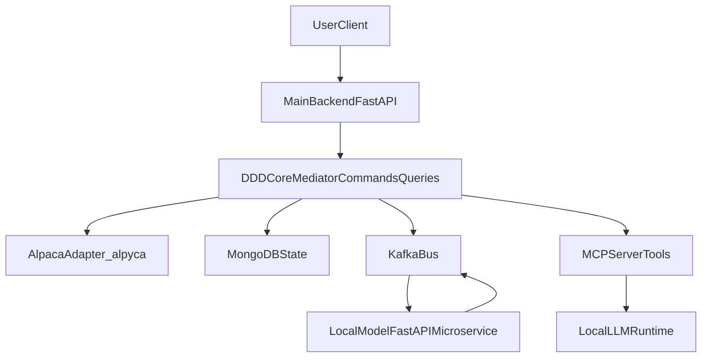

# Alpaca Astro Center - Development Plan

## Planning Principles

- Preserve the existing DDD + Mediator + manual DI architecture skeleton.
- Replace chat-oriented bounded context with telescope-oriented bounded contexts.
- Keep deployment local-first and Docker-first.
- Treat telescope control and AI inference as separate services connected by Kafka.

## Phase 1 - Template Adaptation and Cleanup

### Goal
Transform the current chat-template backend into a neutral telescope platform skeleton.

### Deliverables
- Project naming and metadata updated for Alpaca Astro Center.
- Chat/message API routes and handlers removed or isolated.
- Chat domain entities/events/use-cases removed or replaced.
- Telescope bounded context skeleton created (entities, commands, queries, interfaces).
- DI container updated for new ports/adapters.

### Readiness Criteria
- Backend starts without chat-domain modules.
- Health/readiness endpoints pass.
- No dead imports/references to legacy message/chat modules in startup path.

### Risks and Dependencies
- Existing cross-module imports from legacy message components may break startup.
- Needs careful dependency rewiring in composition root.

## Phase 2 - Alpyca and Astropy Integration

### Goal
Introduce real telescope control primitives and coordinate conversion workflows.

### Deliverables
- `alpyca` client adapter integrated behind interface (`IAlpacaClient`).
- Coordinate transformation service using `astropy`.
- Target resolution workflow definitions for future `astroquery` integration.
- Telescope control command/query flows (status, slew, sync, tracking-state).
- Basic unit tests for coordinate transforms and adapter behavior.

### Readiness Criteria
- Telescope status retrieval works through domain-driven command/query pipeline.
- Coordinate conversion use-cases produce deterministic outputs for test fixtures.
- Alpaca client calls are encapsulated behind interface-based adapters.

### Risks and Dependencies
- Real hardware variability in Alpaca implementations.
- Time/location accuracy required for robust coordinate conversion.
- Need fallback/simulator strategy when telescope hardware is unavailable.

## Phase 3 - MongoDB and Kafka for Telescope Events

### Goal
Establish durable telescope state persistence and event-driven messaging.

### Deliverables
- Mongo repositories for telescope sessions, targets, and operation history.
- Kafka topics and message contracts for telescope events/state transitions.
- Reliable producer/consumer lifecycle wiring in app startup.
- Event versioning strategy for forward compatibility.

### Readiness Criteria
- Main backend stores and retrieves telescope domain state from MongoDB.
- Telescope domain events are published/consumed via Kafka with traceable correlation IDs.
- Restart-safe processing strategy is documented.

### Risks and Dependencies
- Topic design and schema evolution decisions can affect all future services.
- Requires alignment on idempotency and retry semantics.

## Phase 4 - MCP Server and Local Model Microservice

### Goal
Expose telescope control as MCP tools and integrate local AI inference through Kafka.

### Deliverables
- Main backend MCP server layer with telescope-safe tool definitions.
- Dedicated local FastAPI model microservice implemented.
- Kafka contracts between main backend and model microservice finalized:
  - inference request events
  - inference result/status events
  - correlation and timeout behavior
- Guardrails for tool execution (validation, capability checks, safe failure modes).

### Readiness Criteria
- MCP tool requests can trigger full backend execution flows.
- Model microservice can process requests and return results through Kafka.
- End-to-end local flow works without cloud dependencies.

### Risks and Dependencies
- Contract drift between backend and model service.
- Latency and timeout management across async boundaries.
- Hardware profile differences (NVIDIA/AMD/CPU) affect model selection and response times.

## Phase numbering vs `TASKS.md` (hardware gate)

`docs/TASKS.md` uses **Phase 5 Hardware Gate (Seestar Trigger)** for hardware-in-the-loop (HIL) validation on a real device. That checklist is **orthogonal** to the milestone named **Phase 5** in this file (WebSockets + React UI): you can drive the telescope through the **HTTP/MCP API** before a custom frontend exists, but the Seestar HIL items in `TASKS.md` should be treated as the **safety/readiness gate** before calling a stack “telescope-ready” for end users.

## Phase 5 - WebSockets and Frontend Integration

### Goal
Provide real-time user-facing interaction and operational observability so operators (and MCP-assisted flows) are not limited to blind HTTP polling—especially when slewing, syncing, or verifying aim.

### Deliverables
- **MVP operator UI** (`frontend/`, Vite + React): own `docker-compose.yaml` + `Makefile`; repo root `Makefile` runs API + UI (`make dev`); backend CORS for local dev (`CORS_ALLOWED_ORIGINS`).
- **Backend ↔ browser WebSocket channel** for operator telemetry: push telescope status snapshots and (later) command/alert events so the SPA tracks ongoing operations without manual refresh spam. Plain REST remains for commands and heavy reads.
- **Live / still field of view (FOV) for situational awareness:** at minimum, an operator control that can show **a telescope image or stream** (still URL, MJPEG, or future Alpaca Camera / Seestar-specific path) so manual targeting and MCP-assisted moves are not “working in the blind.” Initial milestones may expose only metadata and placeholders until the concrete Seestar or Alpaca camera surface is wired.
- Richer dashboard workflows: target selection, movement presets, live diagnostics (iterations after MVP).
- Basic operator UX for model profile selection and diagnostics visibility (extends MCP/model HTTP today).

### Readiness Criteria
- The SPA can open a **WebSocket** to the main backend and receive **streaming or periodic** telescope state suitable for operator dashboards.
- There is a **documented HTTP contract** (and UI affordance) for **live-view / still capture** availability; when `image_url` (or equivalent) is populated, the operator UI displays it on demand (e.g. one click to refresh the frame).
- Critical control workflows are testable end-to-end.
- Documentation provides reproducible local startup and operation steps.
- Hardware gate passed: Seestar HIL smoke/validation tasks from `docs/TASKS.md` are completed.

### Risks and Dependencies
- **Alpaca HTTP slews are async-only**: hosts implement **`SlewToCoordinatesAsync`**; blocking sync slews are rejected (common **502** symptom: `"Synchronous methods are deprecated"` / **0x400**). Backend clients must poll **`Slewing`** until quiescence (see `ALPACA_SLEW_*` settings and `docs/TASKS.md`).
- **Seestar S30 Pro** live view may **not** map 1:1 to generic Alpaca Camera APIs; expect a **provider-specific** path (vendor protocol, RTSP, or companion contract) alongside Alpaca where applicable—`docs/TASKS.md` tracks investigation and integration milestones.
- Real-time state synchronization complexity across backend, Kafka, and UI.
- Browser WebSockets use `ws`/`wss` (not CORS); operators must point the UI at the correct API host/port (same as REST `VITE_API_BASE`).
- Additional security and safety checks required before broad usage.

## Deployment and Runtime Strategy (Cross-Phase)

- Users clone and run locally with Docker Compose.
- Telescope and host machine must be on the same local network.
- The project must support model runtime profiles:
  - NVIDIA profile
  - AMD profile
  - CPU-only profile
- README and `make` targets must map to profile-specific startup modes and hardware guidance.

## Operator SPA ergonomics (Phase 5)

Classic imaging suites ([N.I.N.A. / Nighttime Imaging ’N’ Astronomy](https://nighttime-imaging.eu/)) organise work into **docked strips**—equipment controls, sequencing, framing, guiding—around a dominant **image/sky surface**. Their [quick-start UI overview](https://nighttime-imaging.eu/docs/master/site/quickstart/uioverview) emphasises draggable panes plus saved layouts (“Imaging layouts” Options). Web constraints mean we defer true docking persisted across sessions.

What we steal for the MVP operator dashboard (`frontend/` SPA):

| Pattern | SPA interpretation |
|---------|---------------------|
| **Segmented workspaces** instead of one monolithic CSS grid spanning unrelated tools | `DashboardZone` sections (`Session`, `Agents & automation`, `Observatory health`, `Imaging desk`, `Mount`). Each zone lays out cards independently so imperfect row counts cannot leave phantom empty columns spanning the whole viewport. |
| **Fluid tiles** resembling instrument strips | `flex-wrap` with ~19–21rem comfy min width; cards stretch per line without forcing a third column when only two cards belong together. |
| **Imaging surface first** | On narrow viewports the MJPEG / still preview stack above configuration notes; on wide screens a sticky sidebar mirrors N.I.N.A.’s tool rail next to the picture. |
| **Save/restore layout** | Future (localStorage, URL hash, or packaged shell). |

**Mount jog vs camera steering:** the operator **Mount** zone includes an equatorial **compass pad** backed by `GET /telescopes/mount/icrs-equatorial` and `POST /telescopes/commands/nudge-equatorial`. That reads Alpaca `RightAscension`/`Declination` (hours / degrees) and applies bounded offsets expressed as **sidereal RA seconds** (east-positive) and **declination arcseconds** (north-positive), then slews to the normalized target. It is **not** a dome or Seestar camera PTZ joystick; independent camera aim remains a vendor/Alpaca-camera follow-up (`docs/TASKS.md`).

Reference capture (RTSP relay, Seestar camera-on behaviour) remains backend-configured; the SPA only surfaces instructions and preview affordances.

## High-Level Flow

## Future Direction (Post-Frontend, v2.0+)

After the frontend phase is stabilized, a potential **v2.0** enhancement is weather-intelligence integration for telescope-safe MCP planning.

### Candidate Integrations
- OpenWeather API
- Alternative weather providers (for example Meteo, WeatherAPI, or self-hosted weather feeds)

### Goal
Provide real-time local observing conditions (cloud cover, wind speed/gusts, humidity, visibility, precipitation risk) as MCP context so AI agents can make safer telescope decisions.

### Expected Impact
- Better go/no-go recommendations before movement or long imaging sessions.
- Smarter target planning when conditions are unstable.
- Reduced risk from commanding telescope actions in poor weather windows.

### Notes
- Weather data should remain advisory/guardrail context unless explicit autonomous policies are introduced.
- Provider abstraction is preferred to avoid hard-coupling to one weather vendor.
